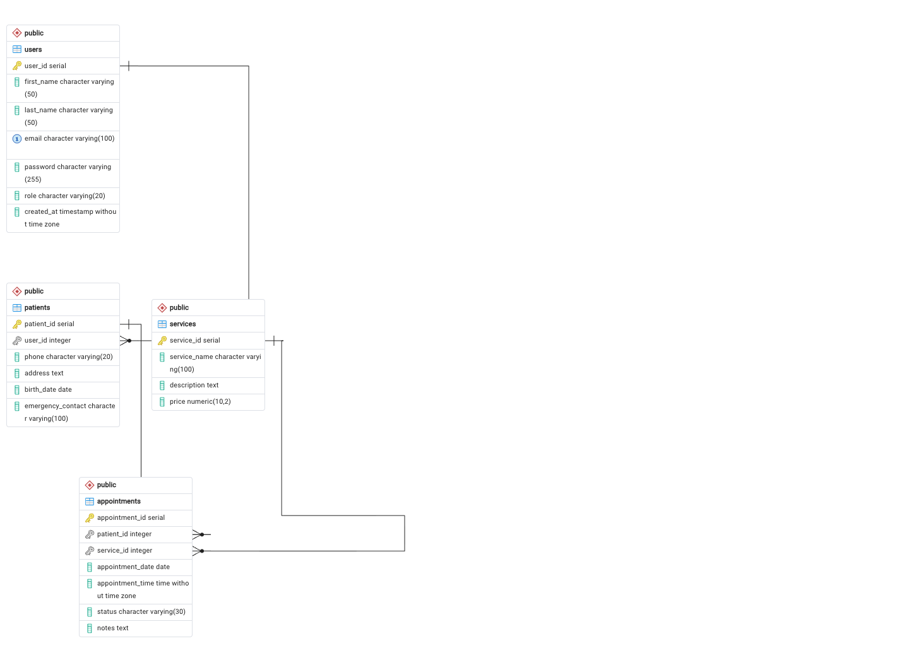

# 🦷 MBL Dental Clinic Booking and Management System

## Overview

The **MBL Dental Clinic Booking and Management System** is a web application developed as the final project for **CSE 340 – Web Backend Development** at **BYU–Idaho**.

The application allows patients to register, log in, book dental appointments, and view their appointments. Administrators can manage patients, appointments, dental services, and user roles through a secure admin dashboard.

This project was inspired by my family's dental clinic, **MBL Dental Clinic**, in the Philippines and was created to provide a more organized and convenient appointment booking and management system.

---

## Features

### Guest Users
- View the home page
- View available dental services
- Create a new account
- Log in to the system

### Patient Features
- Secure login and logout
- View patient dashboard
- Book dental appointments
- View appointment history
- Cancel appointments

### Administrator Features
- View administrator dashboard
- Manage users and update user roles
- Manage patients
- Manage appointments
- Manage dental services
- Add, edit, and delete services
- Edit and delete appointments

---

## Technologies Used

- Node.js
- Express.js
- PostgreSQL
- EJS
- Express Session
- bcrypt
- HTML5
- CSS3
- JavaScript
- Render

---

## Database Tables

The application uses the following database tables:

- Users
- Patients
- Services
- Appointments

---

## Database Schema (ERD)

The following Entity Relationship Diagram (ERD) shows the database structure and relationships used in this project.



---

## User Roles

### Administrator

Administrators can:

- Access the administrator dashboard
- Manage users and update user roles
- Manage patients
- Manage appointments
- Manage dental services
- Add, edit, and delete services

### Patient

Patients can:

- Register an account
- Log in and log out
- Book dental appointments
- View appointment history
- Cancel appointments

---

## Project Structure

```text
mbl-dental-clinic
│
├── public/
│   ├── css/
│   └── images/
│
├── sql/
│   ├── schema.sql
│   └── seed.sql
│
├── src/
│   ├── config/
│   ├── controllers/
│   ├── middleware/
│   ├── models/
│   ├── routes/
│   └── views/
│
├── app.js
├── package.json
└── README.md
```

---

## Installation

Clone the repository:

```bash
git clone https://github.com/angelique213/mbl-dental-clinic.git
```

Navigate to the project folder:

```bash
cd mbl-dental-clinic
```

Install dependencies:

```bash
npm install
```

Create a `.env` file and configure your environment variables:

```text
DATABASE_URL=your_database_url
SESSION_SECRET=your_session_secret
```

Start the application:

```bash
npm start
```

Open your browser and visit:

```text
http://localhost:3000
```

---

## Test Account Credentials

All test accounts use the following password:

**P@$$w0rd!**

### Administrator

Email: `admin@mblclinic.com`

### Patient

Email: `patient@mblclinic.com`

---

## Known Limitations

- Password reset functionality has not been implemented.
- Appointment reminder notifications are not available.
- Image uploads for dental services are not supported.
- The application currently supports two user roles: Administrator and Patient.

---

## Live Application

Render Deployment:

https://mbl-dental-clinic.onrender.com

---

## GitHub Repository

https://github.com/angelique213/mbl-dental-clinic

---

## Author

**Angelique Legaspi**

BYU–Idaho

CSE 340 – Web Backend Development

2026